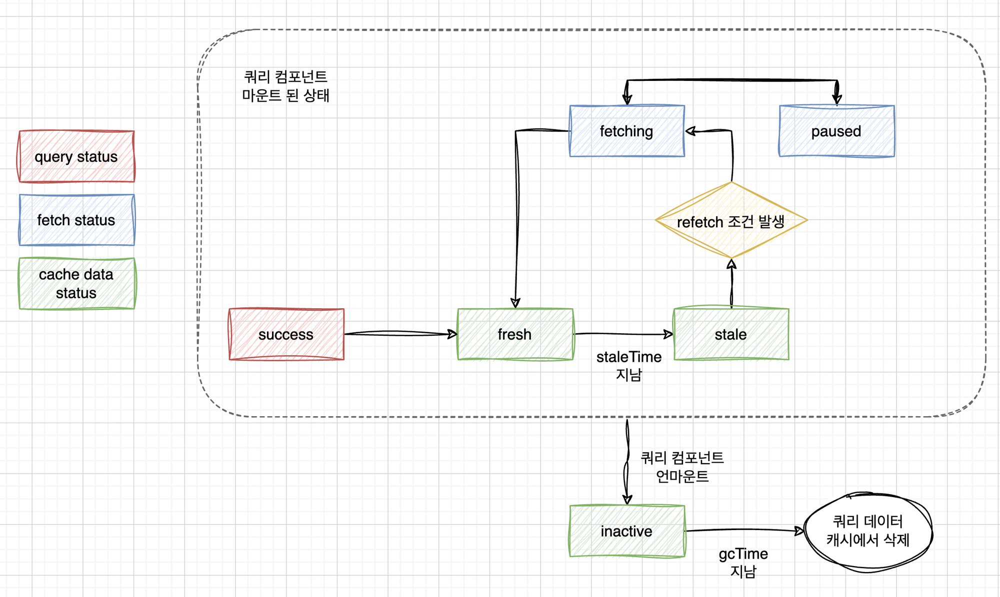
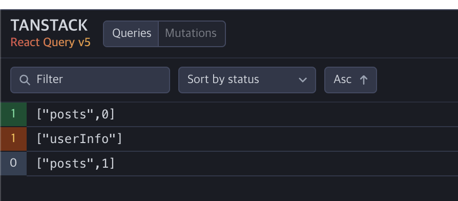

# useQuery 사용하기

## 설치 및 세팅

- 설치

```
npm install @tanstack/react-query
```

- 세팅

```jsx
import { QueryClient, QueryClientProvider } from "@tanstack/react-query";
import HomePage from "./HomePage";

const queryClient = new QueryClient();

function App() {
  return (
    <QueryClientProvider client={queryClient}>
      <HomePage />
    </QueryClientProvider>
  );
}

export default App;
```

## useQuery 기본

- useQuery 는 컴포넌트 최초 로딩 시, 데이터를 Fetch 할 때 사용
- queryKey 와 queryFn 을 사용하여 데이터 요청을 보낼 수 있다
- queryKey 는 ReactQuery 가 캐싱을 관리를 하는 기준이 된다
- queryFn 은 요청을 보내는 함수, 즉 기존의 fetch 내용을 담으면 된다

```jsx
async function getPosts() {
  const response = await fetch(`${BASE_URL}/posts`);
  return await response.json();
}

function HomePage() {
  const { data: postData } = useQuery({
    queryKey: ["posts"],
    queryFn: getPosts,
  });

  const posts = postData?.results ?? [];

  console.log(posts);

  return (
    <div>
      <h1>홈페이지</h1>
      <ul>
        {posts.map((post) => (
          <li key={post.id}>
            {post.user.name}: {post.content}
          </li>
        ))}
      </ul>
    </div>
  );
}

export default HomePage;
```

## staleTime & gcTime

- staleTime

  - 쿼리의 최신 상태를 갱신하는 시간 (기본 0초)
  - 기본 값은 0 이기 때문에 새로 요청이 들어오면 백엔드에 다시 요청을 보내서 결과를 받는다
  - 밀리 세컨드 단위로 시간을 정해주면, 해당 시간 동안 다시 요청이 필요할 경우 캐싱 된 데이터를 가져온다 (통신 X)

- gcTime
  - 쿼리를 요청한 컴포넌트가 언마운트 되었을 때, 캐시에 저장 된 데이터를 삭제하는 시간 (기본 5분)

```jsx
const { data: postData } = useQuery({
  queryKey: ["posts"],
  queryFn: getPosts,
  staleTime: 60 * 1000,
  gcTime: 60 * 1000 * 10,
});
```

;

## Query Status

### Pending

- 요청 보내는 중
- isPending 의 boolean 값으로 확인 가능

### Error

- 에러 발생
- isError 의 boolean 값으로 확인 가능

### Success

- 요청 / 응답 성공
- isSuccess 의 boolean 값으로 확인 가능

- 아래와 같이 상태 값을 받아서 렌더링 처리 가능

```jsx
function HomePage() {
  const queryClient = useQueryClient();

  const {
    data: postData,
    isPending,
    isError,
  } = useQuery({
    queryKey: ["posts"],
    queryFn: getPosts,
    staleTime: 60 * 1000,
    gcTime: 60 * 1000 * 10,
  });

  if (isPending) return <h1>로딩 중</h1>;

  if (isError) return <h1>에러 발생</h1>;

  const posts = postData?.results ?? [];

  console.log(posts);

  return (
    <div>
      <h1>홈페이지</h1>
      <ul>
        {posts.map((post) => (
          <li key={post.id}>
            {post.user.name}: {post.content}
          </li>
        ))}
      </ul>
    </div>
  );
}
```

## useMutation

- 컴포넌트에서 새롭게 서버로 요청(Post, Patch, Delete)을 보낼 때 사용
- useMutation 으로 mutation 을 등록하고, mutate() 로 실행하여 사용

```jsx
function HomePage() {
  // 기존 코드

  const [content, setContent] = useState("");
  const handleInputChange = (e) => {
    setContent(e.target.value);
  };

  // useMutation 작성
  const uploadPostMutation = useMutation({
    mutationFn: (newPost) => uploadPost(newPost),
  });

  const handleSubmit = (e) => {
    e.preventDefault();
    const newPost = { username: "codeit", content };
    // mutate() 를 실행하여 mutationFn 실행
    uploadPostMutation.mutate(newPost);
    setContent("");
  };

  if (isPending) return <h1>로딩 중</h1>;
  if (isError) return <h1>에러 발생</h1>;

  // 기존 코드
}
export default HomePage;
```

### invalidateQueries() 함수

- mutation 으로 업로드가 끝나면 자동으로 refatch 를 하도록 설정이 가능한 함수
- 캐시에 있는 모든 쿼리를 invalidate 하는 함수로, 모든 쿼리가 만료 되었기 때문에 refetch 하여 최신화 한다

- onSuccess 옵션에 invalidateQueries() 를 걸어서 'posts' 쿼리를 최신화 하는 코드

```jsx
import { useQueryClient } from "@tanstack/react-query";

const queryClient = useQueryClient();

const uploadPostMutation = useMutation({
  mutationFn: (newPost) => uploadPost(newPost),
  onSuccess: () => {
    queryClient.invalidateQueries({ queryKey: ["posts"] });
  },
});
```

### useMutation() 함수의 콜백 옵션 (onMutate, onSuccess, onError, onSettled)

- 다양한 상황에 맞게 콜백 함수를 설정하여 부수 효과를 실행 가능

### useMutation() 선언부의 콜백과 mutate() 실행부의 콜백

- useMutation 선언부의 콜백 먼저 실행이 되고, mutate 실행부의 콜백이 실행이 됨
- mutate 실행부는 컴포넌트에 종속되어 있으므로, 컴포넌트가 언마운트 되면 실행이 안된다! 주의 필요!

```jsx
...
// 선언부의 콜백 등록
const uploadPostMutation = useMutation({
  mutationFn: (newPost) => uploadPost(newPost),
  onSuccess: () => {
    queryClient.invalidateQueries({ queryKey: ['posts'] });
  },
});

// 실행부의 콜백 등록
uploadPostMutation.mutate(newPost, {
  onSuccess: () => {
    alert('포스트가 성공적으로 업로드 되었습니다!');
  },
});
```

### Query Status 활용 가능!

- useMutation 도 status 를 제공하므로 해당 값을 활용 가능

- mutation 의 isPending 상태를 이용하여 버튼을 비활성화 하는 코드

```jsx
const uploadPostMutation = useMutation({
  mutationFn: (newPost) => uploadPost(newPost),
  onSuccess: () => {
    queryClient.invalidateQueries({ queryKey: ["posts"] });
  },
});

<button disabled={uploadPostMutation.isPending || !content} type="submit">
  업로드
</button>;
```

## Dependant Query

- 반드시 순서가 지켜져야 하는 쿼리에 사용하는 기능
- useQuery 의 enabled 옵션을 사용하여 해당 옵션이 true 인 경우에만 쿼리를 실행하도록 설정이 가능하다

- userId 가 있는 경우에만 쿼리를 실행하도록 하는 코드

```jsx
const { data: user } = useQuery({
  queryKey: ["user", email],
  queryFn: getUserByEmail,
});

const userId = user?.id;

const { data: projects } = useQuery({
  queryKey: ["projects", userId],
  queryFn: getProjectsByUser,
  enabled: !!userId,
});
```

- 서버에서 사용자 이름을 받아온 경우(로그인)에 컴포넌트 표시값을 바꾸는 코드

```jsx
function HomePage() {
  const [currentUsername, setCurrentUsername] = useState("");

  const { data: userInfoData, isPending: isUserInfoPending } = useQuery({
    queryKey: ["userInfo"],
    queryFn: () => getUserInfo(currentUsername),
    enabled: !!currentUsername,
  });

  const loginMessage = isUserInfoPending
    ? "로그인 중입니다..."
    : `${userInfoData?.name}님 환영합니다!`;

  return (
    <>
      <div>
        {currentUsername ? (
          loginMessage
        ) : (
          <button onClick={handleLoginButtonClick}>로그인</button>
        )}
      </div>
    </>
  );
}
```

## removeQueries

- 캐싱 된 쿼리를 지우는 기능
- 쿼의 정보가 더이상 캐싱이 필요 없어진 경우에 사용

- 로그아웃을 하면 기존에 로그인 된 사용자 정보 캐시를 삭제하는 코드

```jsx
const handleLogoutClick = () => {
  queryClient.removeQueries({
    queryKey: [QUERY_KEYS.USER_INFO, currentUsername],
  });
  setCurrentUsername(undefined);
  navigate("/");
};
```

## PaginatedQuery

- 데이터를 받아올 때 특정 개수만 받아오도록 설정하는 쿼리
- 백엔드에 데이터가 더 있을 경우, hasMore 상태 값이 true 로 들어온다 -> 이를 이용해서 데이터를 더 받아올지 말지 결정이 가능하다
- 해당 방식으로 쿼리 갱신되면 새로운 쿼리로 인식되어 매번 로딩이 발생하며 화면이 깜빡이는 효과를 가진다. 좀 더 부드러운 전환을 위해 placeholderData 라는 것 설정 가능
- placeholderData 옵션에 keepPreviousData 혹은 (prevData) => prevData를 넣어주면 페이지가 새로 바뀌더라도 매번 pending 상태가 되지 않고, 이전의 데이터를 유지해서 보여주다가 새로운 데이터 fetch가 완료되면 자연스럽게 적용 시킨다
- 현재 보여지는 데이터가 이전 placeholderData 인 경우 isPlaceholderData 상태 값을 이용하여 다음 데이터가 로딩되기 전에 다양한 상황에 대처할 수 있다 (ex, 다음 버튼 비활성화 등)

```jsx
// API 파트
export async function getPosts(page = 0, limit = 10) {
  const response = await fetch(`${BASE_URL}/posts?page=${page}&limit=${limit}`);
  return await response.json();
}

// 컴포넌트 파트
import {
  useMutation,
  useQuery,
  useQueryClient,
  keepPreviousData,
} from "@tanstack/react-query";

function HomePage() {
  const {
    data: postData,
    isPending,
    isError,
    isPlaceholderData,
  } = useQuery({
    queryKey: ["posts", page],
    queryFn: () => getPosts(page, PAGE_LIMIT),
    staleTime: 60 * 1000,
    gcTime: 60 * 1000 * 10,
    placeholderData: keepPreviousData,
  });

  // hasMore 이 적용된 버튼 파트
  return (
    <>
      <div>
        <button
          disabled={page === 0}
          onClick={() => setPage((old) => Math.max(old - 1, 0))}
        >
          &lt;
        </button>
        <button
          // 더이상 데이터가 없을 경우 버튼 비활성화
          disabled={!postsData?.hasMore}
          onClick={() => setPage((old) => old + 1)}
        >
          &gt;
        </button>
      </div>
    </>
  );
}
```

### prefetchQuery

- PaginatedQuery 사용시 미리 다음 페이지의 데이터를 fetch 하여 데이터 로딩 시간 없이 부드럽게(seamless) 인터페이스 구현 가능
- 유틸을 통해 확인하면, page 1 이 미리 패치 되어 있는 것을 확인할 수 있다

```jsx
useEffect(() => {
  if (!isPlaceholderData && postsData?.hasMore) {
    queryClient.prefetchQuery({
      queryKey: ["posts", page + 1],
      queryFn: () => getPosts(page + 1, PAGE_LIMIT),
    });
  }
}, [isPlaceholderData, postsData, queryClient, page]);
```



## useInfiniteQuery() 사용하기

- 전체 데이터를 한번에 받아서 캐싱한 이후, 사용하는 쿼리
- useQuery 처럼 쿼리키에 맞게 캐싱하는 것이 아니라 data.pages 라는 배열에 모든 데이터를 받아서 처리한다
- 따라서, initialPageParam 과 getNextPageParam 옵션을 설정해 줘야만 한다
  - initialPageParam : 초기 페이지 설정값
  - getNextPageParam : 아래의 파라미터 값을 통해 다음 페이지 값인 pageParam 을 리턴해야 한다
    - lastPage, allPages, lastPageParam, allPageParams를 파라미터가 존재
    - lastPage : 현재 보여지는 마지막 페이지의 데이터 배열
    - allPages : 전체 데이터의 수와(count), 현재 페이지(currentPage), 다음 데이터 유무(hasMore) 상태 값과, 현재 페이지에 보여지는 데이터를 가지고 있는 배열
    - lastPageParam : 현재 보여지는 마지막 페이지 값
    - allPageParams : 모든 페이지의 각각 페이지 설정값

```jsx
import { useInfiniteQuery } from "@tanstack/react-query";

const {
  data: postsData,
  isPending,
  isError,
} = useInfiniteQuery({
  queryKey: ["posts"],
  queryFn: ({ pageParam }) => getPosts(pageParam, PAGE_LIMIT),
  initialPageParam: 0,
  getNextPageParam: (lastPage, allPages, lastPageParam, allPageParams) =>
    lastPage.hasMore ? lastPageParam + 1 : undefined,
});
```

### 다음 페이지 불러오기

- fetchNextPage() 를 실행하면 getNextPageParam() 함수의 리턴 값이 undefined 또는 null 이 아니면 해당 값을 pageParam 으로 전달하여 다음 페이지 데이터를 가져온다

### 버튼 비활성화 하기

- hasNextPage, isFetchingNextPage 상태값을 활용하면 된다
- hasNextPage 상태 값
  - 다음 페이지가 있는지 확인할 수 있는 boolean 값
- isFetchingNextPage
  - 다음 페이지 정보를 받아오는 중인제 확인이 가능한 boolean 값

```jsx
const {
  data: postsData,
  isPending,
  isError,
  hasNextPage,
  fetchNextPage,
  isFetchingNextPage,
} = useInfiniteQuery({
  queryKey: ["posts"],
  queryFn: ({ pageParam }) => getPosts(pageParam, PAGE_LIMIT),
  initialPageParam: 0,
  getNextPageParam: (lastPage, allPages, lastPageParam, allPageParams) =>
    lastPage.hasMore ? lastPageParam + 1 : undefined,
});

return (
  <button onClick={fetchNextPage} disabled={!hasNextPage || isFetchingNextPage}>
    더 불러오기
  </button>
);
```
